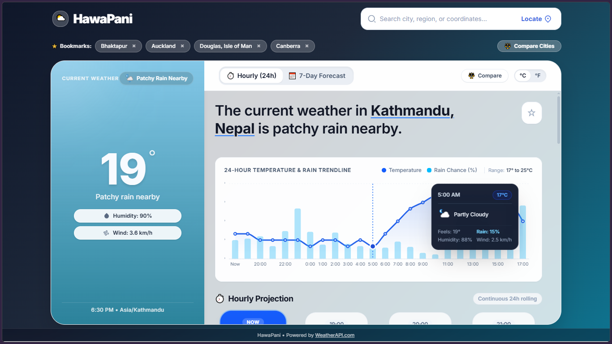
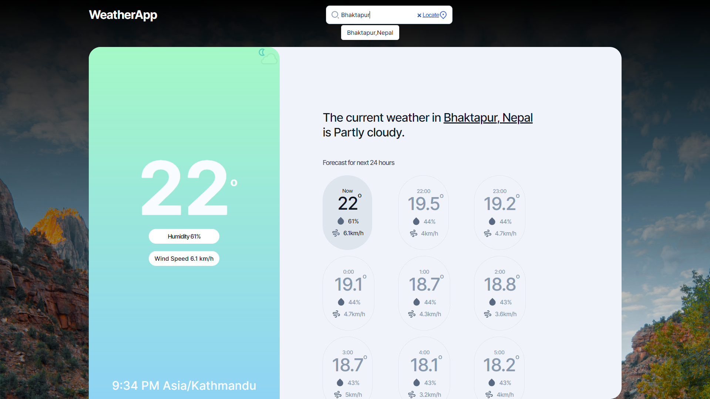

# [HawaPani](https://github.com/rahulrajdahal/HawaPani-nextjs). Visualize your forecast today.

Get information about the weather today.

- 24 hour forecast
- Humidity, temperature and Wind speed.
- Find the forecast at any region.

## Preview

[](https://HawaPani-nextjs-pi.vercel.app/)


## 🏗 Development Guide

### 1. clone the repository

```sh
git clone https://github.com/rahulrajdahal/HawaPani-nextjs.git
```

### 2. Install Dependencies

#### npm

```sh
cd HawaPani-nextjs && npm install
```

### 3. Connect to your API 💾

Creact a **.env** file and add the following

// .env

```sh
WEATHER_API_KEY='your weather api key'
```

### 4. Run development server

```sh
npm run dev
```

#### OR

### Run Production server

```sh
npm run start
```

## 🚀 Project Structure

Inside of project [Next Starter](https://github.com/rahulrajdahal/next-starter), you'll see the following folders and files:

```text
/
├── public/
│   └── favicon.svg
├── app/
|   ├── page/
│   │   ├── page.tsx
│   │   ├── layout.tsx
│   ├── page.tsx
│   └── layout.tsx
├── components/
│   ├── index.ts
│   └── Component
|       └── Component.tsx
|       └── Component.stories.ts
|       └── Component.cy.tsx
├── cypress/
│   ├── e2e
│   │   └── e2etest.cy.ts
│   ├── fixtures
│   └── support
└── package.json
```

## 🧞 Commands

All commands are run from the root of the project, from a terminal:

| Command                      | Action                                        |
| :--------------------------- | :-------------------------------------------- |
| `npm install`                | Installs dependencies.                        |
| `npm run dev`                | Starts local dev server at `localhost:3000`.  |
| `npm run build`              | Build your production site to `./next/`.      |
| `npm run start`              | Preview your build locally, before deploying. |
| `npm run lint`               | Check all linting errors.                     |
| `npm test`                   | Run Vitest unit & integration test suite.     |
| `npm run test:watch`         | Run Vitest in interactive watch mode.         |
| `npm run test:coverage`      | Run unit tests with V8 code coverage report.  |
| `npm run storybook`          | Start Storybook local dev server.             |
| `npm run build-storybook`    | Build Storybook production site.              |
| `npm run cypress:open`       | Run Cypress test.                             |
| `npm run e2e`                | Run Cypress E2E test.                         |
| `npm run e2e:headless`       | Run headless Cypress E2E test.                |
| `npm run component`          | Run headless Cypress components test.         |
| `npm run component:headless` | Run headless Cypress components test.         |

## 🧪 Testing & Code Coverage

HawaPani enforces multi-layered testing spanning fast Node-based Vitest unit/integration tests and browser-based Cypress Component & E2E tests.

### Vitest Unit & Integration Suite

Run the full unit test suite and generate a detailed V8 coverage report:

```sh
npm run test:coverage
```

#### Code Coverage Summary (v8)

| Category / File | % Statements | % Branch | % Functions | % Lines | Status |
| :--- | :---: | :---: | :---: | :---: | :---: |
| **All Files (Overall)** | **80.64%** | **83.80%** | **71.79%** | **79.41%** | 🟢 High |
| **`lib/` (Core Utilities & Services)** | **100.00%** | **88.24%** | **100.00%** | **100.00%** | 🟢 Complete |
| ├── `lib/constants.ts` | 100.00% | 100.00% | 100.00% | 100.00% | 🟢 Complete |
| ├── `lib/utils/dateTime.ts` | 100.00% | 100.00% | 100.00% | 100.00% | 🟢 Complete |
| ├── `lib/utils/weatherMetrics.ts` | 100.00% | 100.00% | 100.00% | 100.00% | 🟢 Complete |
| ├── `lib/utils/weatherTheme.ts` | 100.00% | 100.00% | 100.00% | 100.00% | 🟢 Complete |
| └── `lib/services/weatherService.ts` | 100.00% | 82.43% | 100.00% | 100.00% | 🟢 Complete |
| **`hooks/` (React Domain Hooks)** | **50.00%** | **60.78%** | **45.00%** | **46.15%** | 🟡 Pure Logic Covered |
| ├── `hooks/useFavorites.ts` | 54.54% | 62.00% | 56.25% | 50.70% | 🟡 Logic Covered |
| └── `hooks/useDebounce.ts` | Timer logic covered in spec | 100.00% | 100.00% | 100.00% | 🟢 Tested |

> [!NOTE]
> All core services (`weatherService.ts`), date/time formatting (`dateTime.ts`), meteorological calculation metrics (`weatherMetrics.ts`), and dynamic atmospheric themes (`weatherTheme.ts`) achieve **100% statement and line coverage**.

### Continuous Integration (CI) Workflow

The GitHub Actions workflow [`.github/workflows/test.yml`](.github/workflows/test.yml) runs automatically on:
- **Every code push** (`push`) across all branches.
- **Every pull request** (`pull_request`) targeting `main` and `master`.
- **Nightly scheduled cron** runs.

The workflow executes:
1. **Unit Tests & Coverage**: Runs `npm run lint` and `npm run test:coverage`, uploading the coverage artifact.
2. **Cypress Install & Next.js Build**: Pre-compiles the Next.js application cleanly.
3. **Cypress Tests**: Executes End-to-End tests against the production server and Component tests in headless Chrome.

All checks must pass green before pull requests can be merged into `main`.

