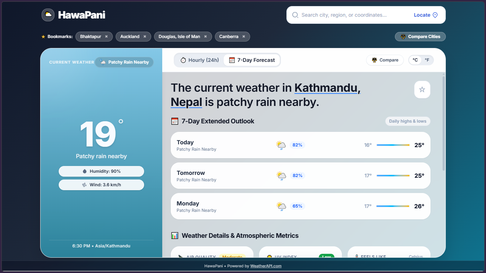

# HawaPani

> A modern, responsive, and privacy-first weather Progressive Web Application (PWA) built with Next.js 16 (App Router), React 19, TypeScript, and Tailwind CSS v4.

[](https://github.com/rahulrajdahal/hawapani/actions/workflows/quality.yml)
[](https://HawaPani-nextjs.vercel.app)
[](https://github.com/rahulrajdahal/hawapani)
[](https://nextjs.org/)
[](https://react.dev/)
[](https://www.typescriptlang.org/)
[](https://tailwindcss.com/)
[](https://storybook.js.org/)
[](https://www.cypress.io/)
[](LICENSE)

---

## 🌐 Live Demo & Preview

Explore the live production deployment on Vercel: **[https://hawapani.vercel.app](https://hawapani.vercel.app)**

|                                Dashboard Overview                                |                                  7 Day Forecast                                   |
| :------------------------------------------------------------------------------: | :-------------------------------------------------------------------------------: |
| [](https://hawapani.vercel.app) | [](https://hawapani.vercel.app) |

---

## ✨ Core Features

- **Real-Time Meteorological Metrics**: Live condition reporting including temperature, feels-like, humidity, wind velocity & direction, barometric pressure, UV safety index, and US-EPA Air Quality Index (AQI).
- **24-Hour Interactive Trendline**: Continuous rolling hourly forecast featuring responsive Bézier temperature curves and precipitation probabilities powered by Recharts.
- **7-Day Extended Outlook**: Comprehensive multi-day forecast cards showing temperature extremes, condition indicators, and day-by-day weather transitions.
- **Fast Location Search**: Debounced city autocomplete with seamless query parameter synchronization (`/?q=<location>`).
- **Quick-Access Favorites**: Bookmark frequently monitored cities locally in `localStorage` without requiring user accounts or database overhead.
- **Side-by-Side City Comparison**: Comparative analysis modal allowing side-by-side evaluation of weather parameters between multiple locations.
- **Offline Resilience & Fallback Game**: Service-worker caching for instant offline forecast access, accompanied by an offline interactive weather mini-game.
- **Dynamic Atmospheric Theming**: Context-aware UI tokens that adapt colors and glassmorphism to current weather conditions (sunny, overcast, rainy, snowy, stormy).
- **Accessibility & Performance**: Built to adhere to WCAG 2.1 AA accessibility standards (keyboard navigation, ARIA landmarks, screen-reader labels) and zero-CLS shimmer skeleton loaders.

---

## 🛠 Tech Stack

| Layer                  | Technology                                                                                               |
| :--------------------- | :------------------------------------------------------------------------------------------------------- |
| **Framework**          | [Next.js 16](https://nextjs.org/) (App Router, Server Components)                                        |
| **Library & Language** | [React 19](https://react.dev/), [TypeScript 5.9](https://www.typescriptlang.org/)                        |
| **Styling**            | [Tailwind CSS v4](https://tailwindcss.com/) with glassmorphic tokens                                     |
| **Data Visualization** | [Recharts 3](https://recharts.org/)                                                                      |
| **UI Primitives**      | [Radix UI](https://www.radix-ui.com/) encapsulated in project wrappers                                   |
| **Weather Data**       | [WeatherAPI](https://www.weatherapi.com/) via secure server-side Route Handlers                          |
| **Testing**            | [Vitest 5](https://vitest.dev/) (Unit/Coverage), [Cypress 16](https://www.cypress.io/) (E2E & Component) |
| **Design System**      | [Storybook 10](https://storybook.js.org/) with axe-based a11y testing                                    |
| **Deployment**         | [Vercel](https://vercel.com/)                                                                            |

---

## 📁 Repository Structure

```text
hawapani/
├── app/                          # Next.js App Router (pages, layouts, metadata)
│   ├── api/weather/              # Server-side Route Handlers for WeatherAPI
│   │   ├── forecast/route.ts     # Forecast data proxy
│   │   └── search/route.ts       # Location autocomplete proxy
│   ├── globals.css               # Tailwind CSS v4 directives & theme tokens
│   ├── layout.tsx                # Root layout, metadata & providers
│   ├── not-found.tsx             # Atmospheric 404 error page
│   └── page.tsx                  # Main weather dashboard page
├── components/                   # Accessible UI components & Radix wrappers
│   ├── AlertBanner/              # Severe weather alert notifications
│   ├── CityComparisonModal/      # Side-by-side comparative analysis modal
│   ├── DailyForecastCard/        # 7-day forecast cards
│   ├── FavoritesBar/             # LocalStorage bookmarks bar
│   ├── HourForecastCard/         # 24-hour hourly forecast cards
│   ├── MetricsGrid/              # Atmospheric & AQI metrics grid
│   ├── Navbar/                   # Header navigation & search trigger
│   ├── SearchInput/              # Accessible combobox search input
│   ├── WeatherDashboardSkeleton/ # Zero-CLS shimmer loading state
│   └── WeatherTrendChart/        # 24-hour Recharts Bézier chart
├── docs/                         # Architecture, security, API & testing documentation
├── hooks/                        # Custom React hooks (useFavorites, useDebounce)
├── lib/                          # Services, types, meteorological math, and themes
│   ├── constants.ts              # Default configurations & fallback constants
│   ├── types/weather.ts          # Strongly-typed weather domain interfaces
│   ├── services/weatherService.ts # API client & response mappers
│   └── utils/                    # dateTime, weatherMetrics, weatherTheme
├── cypress/                      # Cypress 16 E2E and component test specs
├── stories/                      # Storybook component documentation & stories
└── .github/workflows/            # Continuous integration quality pipelines
```

---

## 🚀 Getting Started

### Prerequisites

- **Node.js**: `20.x` or higher
- **npm**: `10.x` or higher
- A free API key from [WeatherAPI.com](https://www.weatherapi.com/)

### 1. Clone the Repository

```bash
git clone https://github.com/rahulrajdahal/hawapani.git
cd hawapani
```

### 2. Install Dependencies

```bash
npm install
```

### 3. Configure Environment Variables

Create a `.env` file in the root directory:

```bash
cp .env.example .env
```

Add your WeatherAPI credentials:

```env
WEATHER_API_KEY=your_actual_weather_api_key_here
```

> [!NOTE]
> All WeatherAPI credentials are strictly confined to server-side Route Handlers (`app/api/weather/*`). Secrets are never exposed to client-side bundles or browser requests.

### 4. Run the Development Server

```bash
npm run dev
```

Open [http://localhost:3000](http://localhost:3000) in your browser to view the application.

---

## 🧞 Available Scripts

| Command                      | Description                                                            |
| :--------------------------- | :--------------------------------------------------------------------- |
| `npm run dev`                | Starts the Next.js local development server at `localhost:3000`.       |
| `npm run build`              | Compiles the optimized production application.                         |
| `npm run start`              | Runs the compiled production build locally.                            |
| `npm run lint`               | Checks TypeScript type integrity across the codebase (`tsc --noEmit`). |
| `npm run test:unit`          | Runs Vitest unit and integration test suites.                          |
| `npm run test:watch`         | Runs Vitest in interactive watch mode for active development.          |
| `npm run test:coverage`      | Generates a detailed V8 code coverage report in `./coverage`.          |
| `npm run storybook`          | Starts the local Storybook workbench server at `localhost:6006`.       |
| `npm run build-storybook`    | Compiles the Storybook design system into static documentation.        |
| `npm run cypress:open`       | Opens the interactive Cypress GUI runner.                              |
| `npm run e2e`                | Starts dev server and opens Cypress E2E test suite.                    |
| `npm run e2e:headless`       | Runs Cypress E2E test suite headlessly against local server.           |
| `npm run component`          | Opens Cypress Component test runner interactively.                     |
| `npm run component:headless` | Runs Cypress Component tests headlessly.                               |
| `npm test`                   | Runs the comprehensive test suite (unit, coverage, component, E2E).    |

---

## 🧪 Testing & Quality Assurance

HawaPani implements a multi-tier testing and verification architecture:

1. **Unit & Mathematical Precision (Vitest 5)**:
   - Tests pure functions, meteorological formulas (heat index, dew point, wind chill, air quality categorization), date/time parsers, and custom hooks.
   - Generates comprehensive V8 statement, branch, function, and line coverage.
2. **Component Workbench & Accessibility (Storybook 10)**:
   - Isolated component playground documenting various atmospheric states.
   - Axe-core automated accessibility audits (`@storybook/addon-a11y`).
3. **End-to-End & Integration (Cypress 16)**:
   - Validates critical user journeys: location search, favorites persistence, weather comparison, metric unit toggles, and offline handling.

### CI/CD Quality Pipeline

Automated checks run on every pull request and push to `main` via GitHub Actions ([`.github/workflows/quality.yml`](.github/workflows/quality.yml)):

```
Push / Pull Request
  ├── 1. Lint & Typecheck (tsc --noEmit)
  ├── 2. Unit Tests & V8 Coverage (vitest --coverage)
  ├── 3. Storybook Build (storybook build)
  ├── 4. Production Next.js Build (next build)
  └── 5. Cypress E2E & Component Headless Tests
```

---

## 📄 License

Distributed under the MIT License. See [LICENSE](LICENSE) for more information.
