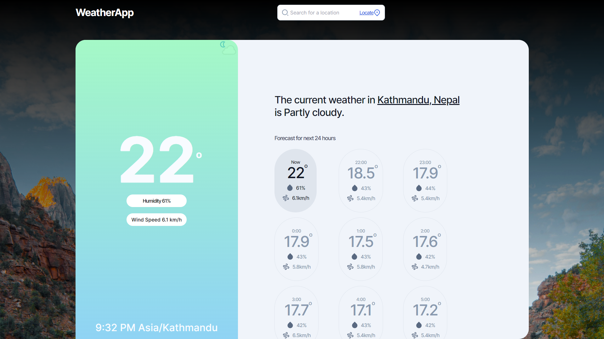

# [WeatherApp](https://github.com/rahulrajdahal/weatherapp-nextjs). Visualize your forecast today.

Get information about the weather today.

- 24 hour forecast
- Humidity, temperature and Wind speed.
- Find the forecast at any region.

## Preview

[](https://weatherapp-nextjs-pi.vercel.app/)


## 🏗 Development Guide

### 1. clone the repository

```sh
git clone https://github.com/rahulrajdahal/weatherapp-nextjs.git
```

### 2. Install Dependencies

#### npm

```sh
cd weatherapp-nextjs && npm install
```

### 3. Connect to your API 💾

Creact a **.env** file and add the following

// .env

```sh
NEXT_PUBLIC_WEATHER_APIKEY='your weather api key'
```

### 4. Run development server

```sh
npm run dev
```

#### OR

### Run Production server

```sh
npm run start
```

## 🚀 Project Structure

Inside of project [Next Starter](https://github.com/rahulrajdahal/next-starter), you'll see the following folders and files:

```text
/
├── public/
│   └── favicon.svg
├── app/
|   ├── page/
│   │   ├── page.tsx
│   │   ├── layout.tsx
│   ├── page.tsx
│   └── layout.tsx
├── components/
│   ├── index.ts
│   └── Component
|       └── Component.tsx
|       └── Component.stories.ts
|       └── Component.cy.tsx
├── cypress/
│   ├── e2e
│   │   └── e2etest.cy.ts
│   ├── fixtures
│   └── support
└── package.json
```

## 🧞 Commands

All commands are run from the root of the project, from a terminal:

| Command                      | Action                                        |
| :--------------------------- | :-------------------------------------------- |
| `npm install`                | Installs dependencies.                        |
| `npm run dev`                | Starts local dev server at `localhost:3000`.  |
| `npm run build`              | Build your production site to `./next/`.      |
| `npm run start`              | Preview your build locally, before deploying. |
| `npm run lint`               | Check all linting errors.                     |
| `npm run storybook`          | Start Storybook local dev server.             |
| `npm run build-storybook`    | Build Storybook production site.              |
| `npm run cypress:open`       | Run Cypress test.                             |
| `npm run e2e`                | Run Cypress E2E test.                         |
| `npm run e2e:headless`       | Run headless Cypress E2E test.                |
| `npm run component`          | Run headless Cypress components test.         |
| `npm run component:headless` | Run headless Cypress components test.         |
